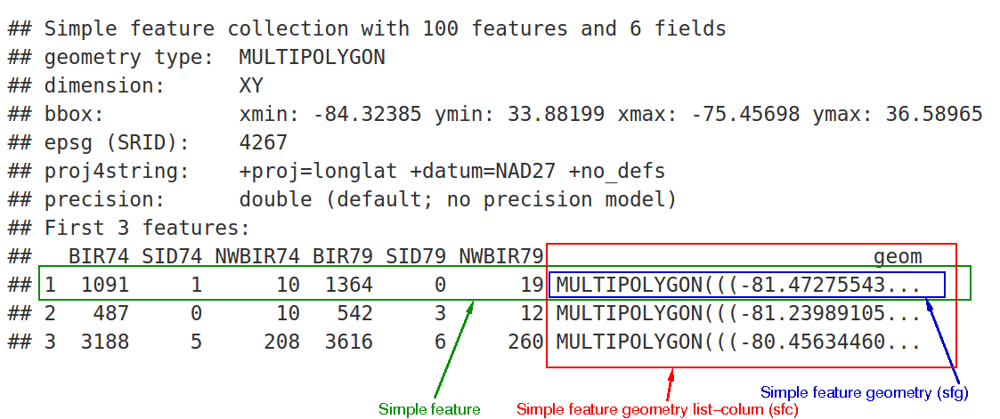
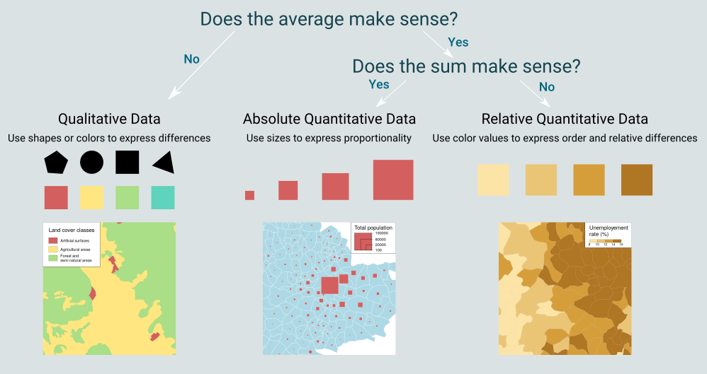

# The spatial ecosystem in R 

```{r, echo=FALSE}
# Different settings for HTML and revealjs output
code_folding = ifelse(knitr::pandoc_to()=="html", "false", "true")
```

```{css}
/*| echo: false */
[id^="section"] .anchored {
  margin: 0;
  border: 0;
  padding:0;
}
[id^="section"] .anchorjs-link {
  display:none;
}
```


```{r installPackages, echo=FALSE, include=FALSE}
## List of libraries used
packages <- c("dplyr", "mapview", "sf", "osmdata",
              "RColorBrewer", "ggplot2", "readr",
              "ggspatial", "sfnetworks", "tidygraph", "remotes", 
              "tidygeocoder","btb")
## Check whether the library is installed; if not, install it and then load it
package.check <- lapply(
  packages,
  FUN = function(x) {
    if (!require(x, character.only = TRUE)) {
      install.packages(x, dependencies = TRUE)
      library(x, character.only = TRUE)
    }
  }
)
```

## Introduction to `sf` 

* `sf` website: [Simple Features for R](https://r-spatial.github.io/sf/index.html)

* sf stands for Simple Features

* It aims to bring together the functionality of former packages (`sp`, `rgeos` and `rgdal`) into a single one

* Makes it easier to manipulate spatial data, with simple objects. 

* [Tidy data](http://vita.had.co.nz/papers/tidy-data.html): compatible with pipe syntax ` |> ` and `tidyverse` operators.

* Main author and maintainer: Edzer Pebesma (also author of the `sp` package)


## Structure of an sf object: 




## Importing / exporting data 

Import

```{r, echo = TRUE, comments = FALSE}
library(sf)
mtq <- read_sf("data/mtq/martinique.shp")
mtq <- st_read("data/mtq/martinique.shp")
```

## 

Export 

```{r, eval = FALSE, echo = TRUE}
#export
write_sf(mtq,"data/mtq/martinique.gpkg",delete_layer = TRUE)
st_write(mtq,"data/mtq/martinique.gpkg",delete_layer = TRUE)
```

The gpkg (geopackage) format is open (not tied to an operating system) and implemented as a SQLite database.
 

<small>
Also note the existence of the GeoParquet format, which is extremely efficient for processing large volumes of spatial data.
</small>
  

## Coordinate system

Projections/coordinate systems are identified by a code called an EPSG code:

- lat/long : 4326 [https://epsg.io/4326](https://epsg.io/4326)
- Lambert 93 : 2154 [https://epsg.io/2154](https://epsg.io/2154)
- Pseudo-Mercator : 3857 [https://epsg.io/3857](https://epsg.io/3857)
- Lambert azimuthal equal area : 3035 [https://epsg.io/3035](https://epsg.io/3035)

## Projection 

Obtain the projection using `st_crs()` ([code epsg](https://epsg.io/)) and modify it using `st_transform()`.

<small>
`sf` uses spherical geometry by default for unprojected data since version 1.0 thanks to the `s2` library. See [https://r-spatial.github.io](https://r-spatial.github.io/sf/articles/sf7.html) for more details.
</small>


```{r}
st_crs(mtq)
mtq_4326 <- mtq |> st_transform(4326)
```


## Displaying data

Default display: 

```{r, nm=TRUE}
plot(mtq)
```

##

Keeping only the geometry: 

```{r, nm=TRUE}
plot(st_geometry(mtq))
```

## Extracting centroids

```{r, nm=TRUE}
mtq_c <- st_centroid(mtq) 
plot(st_geometry(mtq))
plot(st_geometry(mtq_c), add = TRUE, cex = 1.2, col = "red", pch = 20)
```

## Distance matrix

```{r, nm=TRUE}
mat <- st_distance(x = mtq_c, y = mtq_c)
mat[1:5, 1:5]
```

## Polygon aggregation 

Simple union: 

```{r, nm = TRUE}
mtq_u <- st_union(mtq)
plot(st_geometry(mtq), col="lightblue")
plot(st_geometry(mtq_u), add=T, lwd=2, border = "red")
```

##

Based on a grouping variable: 

```{r, nm = TRUE}
library(dplyr)
mtq_u2 <- mtq |> 
  group_by(STATUT) |> 
  summarize(P13_POP = sum(P13_POP))
plot(st_geometry(mtq), col="lightblue")
plot(st_geometry(mtq_u2), add = TRUE, lwd = 2, border = "red", col = NA)
```

## Buffer zone 


```{r, nm = TRUE}
mtq_b <- st_buffer(x = mtq_u, dist = 5000)
plot(st_geometry(mtq), col = "lightblue")
plot(st_geometry(mtq_u), add = TRUE, lwd = 2)
plot(st_geometry(mtq_b), add = TRUE, lwd = 2, border = "red")
```

## Polygon intersection 

We create a polygon.

```{r, nm=TRUE}
m <- rbind(c(700015,1624212), c(700015,1641586), c(719127,1641586), 
           c(719127,1624212), c(700015,1624212))
p <- st_sf(st_sfc(st_polygon(list(m))), crs = st_crs(mtq))
plot(st_geometry(mtq))
plot(p, border = "red", lwd = 2, add = TRUE)
```

##

`st_intersection()` extracts the part of `mtq` that intersects with the created polygon.  

```{r, nm=TRUE, warning=F}
mtq_z <- st_intersection(x = mtq, y = p)
plot(st_geometry(mtq))
plot(st_geometry(mtq_z), col = "red", border = "green", add = TRUE)
```


## Counting points in polygons  

`st_sample()` creates random points on the map. 

```{r , echo = FALSE}
set.seed(1) #Fixer l'aléa pour toujours faire la même carte.
```

```{r, nm=TRUE}
pts <- st_sample(x = mtq, size = 50)
plot(st_geometry(mtq))
plot(pts, pch = 20, col = "red", add=TRUE, cex = 1)
```

##

`st_join` performs a spatial join combined with an aggregation.


<small>
The join can be finely controlled (points on boundaries, ...) with the `join` argument, which is set by default to `st_intersects()`. See [here](https://en.wikipedia.org/wiki/DE-9IM) for a precise definition of the possible spatial predicates. 
</small>

```{r p0a, nm=TRUE}
mtq_counts <- mtq |>
st_join(st_as_sf(pts))

head(mtq_counts |> select(INSEE_COM),3)
```

##

```{r p0b, nm=TRUE}
mtq_counts <- mtq_counts |>
count(INSEE_COM)

head(mtq_counts)
```

##

```{r p0c, nm=TRUE}
plot(mtq_counts|> select(n))
plot(pts, pch = 20, col = "red", add = TRUE, cex = 1)
```

## Voronoi polygons

A Voronoi diagram is a partition of the plane into cells (adjacent regions, called Voronoi polygons) from a discrete set of points. Each cell contains a single point and consists of all the points in the plane that are closer to that point than to any other. 


See also [here](https://github.com/r-spatial/sf/issues/474) and [there](https://stackoverflow.com/questions/45719790/create-voronoi-polygon-with-simple-feature-in-r).

##

```{r, echo=TRUE,warning=FALSE,message=FALSE,fig.show='last',fig.height=4.5}
mtq_v <- st_collection_extract(st_voronoi(x = st_union(mtq_c)))
mtq_v <- st_intersection(mtq_v, st_union(mtq))
mtq_v <- st_join(x = st_sf(mtq_v), y = mtq_c)
plot(st_geometry(mtq_v), col='lightblue')
```

## Other operations

- st_area(x)
- st_length(x)
- st_disjoint(x, y, sparse = FALSE)
- st_touches(x, y, sparse = FALSE)
- st_crosses(s, s, sparse = FALSE)
- st_within(x, y, sparse = FALSE)
- st_contains(x, y, sparse = FALSE)
- st_overlaps(x, y, sparse = FALSE)

##

- st_equals(x, y, sparse = FALSE)
- st_covers(x, y, sparse = FALSE)
- st_covered_by(x, y, sparse = FALSE)
- st_equals_exact(x, y,0.001, sparse = FALSE)
- ...

## Conversion
- st_cast 
- st_collection_extract
- st_sf
- st_as_sf
- st_as_sfc


<!-- # Prepare / retrieve data  -->

<!-- In this first example, the data are stored in a shapefile.  -->

<!-- ```{r, eval=TRUE,cache=FALSE} -->
<!-- library(sf) -->
<!-- library(dplyr) -->
<!-- # Import of the geographical layer (IRIS of Paris) -->
<!-- iris.75 <- st_read("data/iris_75.shp", stringsAsFactors = F)  -->
<!-- ``` -->

<!-- Let's look at the projection used:  -->

<!-- ```{r, eval=TRUE,cache=FALSE} -->
<!-- st_crs(iris.75) -->
<!-- ``` -->

<!-- In this second example, the data are point data stored in a csv file with two columns (latitude and longitude in WGS84). In this case, we import the csv and then convert the `data.frame` into a spatial (`sf`) `data.frame` using the `st_as_sf` function. You simply need to specify the names of the columns containing the coordinates and the CRS. Generally, the WGS84 EPSG code (4326) will be used. -->

<!-- ```{r, eval=TRUE,cache=FALSE, fig.height=5} -->
<!-- # Import the dataset   -->
<!-- accidents.2019.paris <- readRDS("data/accidents2019_paris.RDS") -->
<!-- # Transformation en objet sf -->
<!-- accidents.2019.paris <- st_as_sf(accidents.2019.paris, -->
<!--                                 coords = c("long", "lat"), -->
<!--                                 crs = 4326, agr = "constant") |>  -->
<!--   st_transform(2154) -->
<!-- plot(st_geometry(accidents.2019.paris)) -->
<!-- ``` -->


<!-- Let's take a quick look at these two datasets. -->

<!-- First, let's locate the injured people according to the severity of their injuries -->

<!-- ```{r, eval=TRUE,cache=FALSE, fig.height=5} -->
<!-- plot(st_geometry(iris.75)) -->
<!-- # People who were uninjured or slightly injured -->
<!-- plot(accidents.2019.paris |> filter(grav%in%c(1,4)) |> st_geometry, -->
<!--      pch = 20, col = "darkgreen", add=TRUE, cex = 0.5) -->
<!-- # People who were seriously injured -->
<!-- plot(accidents.2019.paris |> filter(grav == 3) |> st_geometry, -->
<!--      pch = 20, col = "orange", add=TRUE, cex = 0.5) -->
<!-- # People who were killed -->
<!-- plot(accidents.2019.paris |> filter(grav == 2) |> st_geometry, -->
<!--      pch = 20, col = "red", add=TRUE, cex = 1) -->
<!-- ``` -->

<!-- Count by IRIS:  -->

<!-- 1. the number of injured people (`nbacc`) ; -->
<!-- 1. the number of injured people who were seriously injured or killed (`nbacc_blessgravtues`). -->

<!-- ```{r, eval=TRUE,cache=FALSE, fig.height=5} -->
<!-- inter <- st_intersects(iris.75, accidents.2019.paris) -->
<!-- inter_blessgravtues <- st_intersects(iris.75, accidents.2019.paris -->
<!--                               |> filter(grav%in%c(2,3))) -->
<!-- iris.75$nbacc <- sapply(X = inter, FUN = length) -->
<!-- iris.75$nbacc_blessgravtues <- sapply(X = inter_blessgravtues, FUN = length) -->

<!-- #Note: 24 accidents are missing -->
<!-- nrow(accidents.2019.paris)-sum(iris.75$nbacc) -->
<!-- ``` -->

<!-- ## Using `osmdata` -->


<!-- `osmdata` can extract elements from the free and open-source OpenStreetMap database. This can be useful, for example, to retrieve map decoration elements: rivers, roads or other information. -->

<!-- The query follows the OSM nomenclature based on [keys / values](https://wiki.openstreetmap.org/wiki/Tags). You can use [tagingo](https://taginfo.openstreetmap.org/) to explore all the keys and values used by the OSM community. -->

<!-- ```{r, eval=FALSE,cache=FALSE} -->
<!-- library(osmdata) -->
<!-- # Retrieve the main roads using OSM -->
<!-- bb      <- iris.75 |> st_transform(4326) |> st_bbox() -->
<!-- q       <- opq(bbox = bb,timeout = 180) -->
<!-- qm      <- add_osm_feature (q, key = 'highway', -->
<!--                             value = 'motorway', value_exact = FALSE) -->
<!-- qt      <- add_osm_feature (q, key = 'highway', -->
<!--                             value = 'trunk', value_exact = FALSE) -->
<!-- qp      <- add_osm_feature (q, key = 'highway', -->
<!--                             value = 'primary', value_exact = FALSE) -->

<!-- motorway<- osmdata_sf(qm) -->
<!-- trunk   <- osmdata_sf(qt) -->
<!-- primary <- osmdata_sf(qp) -->

<!-- roads    <- c(primary,trunk,motorway)$osm_lines |> -->
<!--   st_transform(st_crs(iris.75)) -->
<!-- roads.geom = st_geometry(roads) -->

<!-- # Retrieve the shape of the Seine  -->
<!-- qr <- q |>  -->
<!--   add_osm_feature (key = 'waterway') |>  -->
<!--   add_osm_feature(key = "name:fr", value = "La Seine") -->
<!-- river <- osmdata_sf(qr) -->

<!-- river.geom <- c(st_geometry(river$osm_lines), -->
<!--                 st_geometry(river$osm_multilines)) |> -->
<!--   st_transform(st_crs(iris.75)) -->

<!-- # Export road and river layers to shapefile -->
<!-- st_write(roads|> select(name,osm_id), dsn = "data/osmdata/roadsfull.gpkg") -->
<!-- st_write(roads.geom, dsn = "data/osmdata/road.shp") -->
<!-- st_write(river.geom, dsn = "data/osmdata/river.shp") -->
<!-- ``` -->

<!-- ```{r , echo = FALSE} -->
<!-- roads <- st_read(dsn = "data/osmdata/roadsfull.gpkg", quiet = TRUE) -->
<!-- roads.geom <- st_read(dsn = "data/osmdata/road.shp", quiet = TRUE) -->
<!-- river.geom <- st_read(dsn = "data/osmdata/river.shp", quiet = TRUE) -->
<!-- ``` -->


<!-- Let's use these data to add some decoration to our map: -->

<!-- ```{r, eval=TRUE,cache=FALSE, fig.height=4.75} -->
<!-- # bbox is used to center on Paris -->
<!-- bb <- st_bbox(iris.75) -->
<!-- par(mar = c(0.2, 0.2, 1.4, 0.2), bg = "ivory") -->
<!-- plot(st_geometry(iris.75), col = "ivory", border = "ivory3",  -->
<!--      xlim = bb[c(1,3)], ylim =  bb[c(2,4)]) -->
<!-- plot(st_geometry(roads.geom), col="#666666", lwd = 1.2, add = TRUE) -->
<!-- plot(st_geometry(river.geom), col="#87cdde", lwd = 3, add = TRUE) -->
<!-- plot(st_geometry(accidents.2019.paris |> filter(grav == 3 )) , pch = 20, -->
<!--      col = "orange", add=TRUE, cex = 1) -->
<!-- plot(st_geometry(accidents.2019.paris |> filter(grav == 2)) , pch = 20, -->
<!--      col = "red", add=TRUE, cex = 1) -->
<!-- ``` -->


<!-- ## Geocoding -->

<!-- Geocoding means **going from an address** to a **geographical position**. In France, the [Base Adresse Nationale (BAN)](https://adresse.data.gouv.fr/) allows this task to be carried out efficiently. -->

<!-- In R, the `banR` package can query the BAN API. This package, which is not available on CRAN, must be installed via GitHub. It can then geocode an address column in batch, i.e. using a minimum number of requests to avoid overloading the API. You simply need to specify the column containing the addresses, and optionally a column containing the Insee code of the municipality, to facilitate and refine the query. -->

<!-- For international addresses, it is possible to use `tidygeocoder`, which can query different APIs (free or paid). This package works in a fairly similar way to the previous one. -->

<!-- The `banR` API is faster than the `tidygeocoder` API.  -->

<!-- ```{r p1, eval=TRUE,cache=TRUE, fig.height=4.75} -->
<!-- # With the coordinates present in the database -->
<!-- geo_bdd <- accidents.2019.paris |>  -->
<!--   filter(catv %in% c("VAE", "EDP à moteur")) |> slice(1:10) -->

<!-- # With banR -->
<!-- # remotes::install_github("joelgombin/banR") -->
<!-- library(banR) -->
<!-- geo_banR <- accidents.2019.paris |>  -->
<!--   filter(catv %in% c("VAE", "EDP à moteur")) |> slice(1:10) |>  -->
<!--   geocode_tbl(adresse = voie,code_insee = com) |> -->
<!--   select(latitude,longitude) |> -->
<!--   st_as_sf(coords = c("longitude", "latitude"), -->
<!--            crs = 4326, agr = "constant") |> -->
<!--   st_transform(2154) -->

<!-- # With tidygeocoder -->
<!-- # install.packages("tidygeocoder") -->
<!-- library(tidygeocoder) -->
<!-- geo_tidygeocoder <- accidents.2019.paris |>  -->
<!--   filter(catv %in% c("VAE", "EDP à moteur")) |> slice(1:10) |> -->
<!--   mutate(addr = paste(voie, ", Paris, France")) |>   -->
<!--   geocode(addr,method = "osm") |> select(lat, long) |> -->
<!--   st_as_sf(coords = c("long", "lat"),crs = 4326, agr = "constant") |> -->
<!--   st_transform(2154) -->

<!-- ## Distances and mean distance between the three types of geocoding -->
<!-- # Between the database geocoding and banR -->
<!-- st_distance(geo_bdd, geo_banR, by_element = TRUE) -->
<!-- mean(st_distance(geo_bdd, geo_banR, by_element = TRUE)) -->
<!-- # Between the database geocoding and tidygeocoder -->
<!-- st_distance(geo_bdd,geo_tidygeocoder, by_element = TRUE) -->
<!-- mean(st_distance(geo_bdd, geo_tidygeocoder,by_element = TRUE)) -->
<!-- # Between banR and tidygeocoder -->
<!-- st_distance(geo_banR, geo_tidygeocoder, by_element = TRUE) -->
<!-- mean(st_distance(geo_banR, geo_tidygeocoder, by_element = TRUE)) -->
<!-- ``` -->

# Creating interactive and static maps

In this section, we will visualize data on [road traffic injury accidents](https://www.data.gouv.fr/fr/datasets/bases-de-donnees-annuelles-des-accidents-corporels-de-la-circulation-routiere-annees-de-2005-a-2019/) from 2019.

## 

It is a `data.frame` containing, in particular, two columns giving the latitude and longitude of road accidents.

```{r}
accidents.2019.paris <- readRDS("data/accidents2019_paris.RDS")
head(accidents.2019.paris)
```

##

This `data.frame` must be converted into a spatial object (`sf`) using the `st_as_sf` function. You simply need to specify the names of the columns containing the coordinates and the projection, here `CRS = 4326` (WGS 84). These data are then transformed to `CRS = 2154` (Lambert 93).

```{r}
accidents.2019.paris <- st_as_sf(accidents.2019.paris,
                                coords = c("long", "lat"),
                                crs = 4326) |>
  st_transform(2154)
```

##

```{r, fig.height=5}
plot(st_geometry(accidents.2019.paris))
```
## Interactive maps

Several solutions are available for creating interactive maps with R. `mapview`, `leaflet` and `mapdeck` are the main ones. For simplicity, we focus here on `mapview`.

Interactive maps are not necessarily very relevant for representing geostatistical information. However, they are useful for exploring databases. Let us look at an example with `mapview` concerning fatal accidents in Paris in 2019. 

##
```{r}
library(mapview)
```

```{r, echo=FALSE}
#to work with the .Rmd format
mapviewOptions(fgb = FALSE)
# to avoid being too tall in the slides
mapviewOptions(leafletHeight=400)
```

```{r}
individus_tues <- accidents.2019.paris |>
  filter(grav == 2) |> # grav = 2 : individus tués
  mutate(age=2019-an_nais) # age
mapview(individus_tues)
```


## 

When clicking on a point, the values of the different variables in the database appear. This can help with exploring the database. Let us customize it a little...

```{r, echo=FALSE}
# to avoid being too tall in the slides
mapviewOptions(leafletHeight=300)
```

```{r, cache=FALSE}
mapview(individus_tues,
        map.types = "OpenStreetMap.Mapnik", legend = TRUE,
        cex = 5, col.regions = "#217844", lwd = 0, alpha = 0.9,
        layer.name = 'Individus tués')
```

## 

Let us customize it a little further...

However, adding a legend for the size of proportional circles is not easy. 


```{r, echo=FALSE}
# to avoid being too tall in the slides
mapviewOptions(leafletHeight=300)
```

```{r, cache=FALSE}
mapview(individus_tues,
        map.types = "OpenStreetMap.Mapnik", legend=TRUE,
        layer.name = 'Individus tués',
        cex="age", zcol="sexe", lwd=0, alpha=0.9
       )
```

## Static maps with `ggplot2`

Again, different R packages are used to create static maps: 

- `ggplot2` is a widely used package for creating all types of plots, and has been specifically adapted for maps (`geom_sf`). 
- The `tmap` package contains advanced features based on the logic of `ggplot2`
- `mapsf` (successor to `cartography`) is based on a so-called "base R" language and allows basic as well as advanced cartographic representations.

## 

For simplicity, we focus here on `ggplot2`, a very well-known package for all types of plots.

## The grammar of graphics

- Wilkinson, L., Anand, A., & Grossman, R. (2005). Graph-theoretic scagnostics. In Information Visualization, IEEE Symposium on (pp. 21-21). IEEE Computer Society.
- Repris par Wickham, H. (2010). A layered grammar of graphics. Journal of Computational and Graphical Statistics, 19(1), 3-28. And implemented in `ggplot2`
- grammar &#8594; same construction / philosophy for all types of plots

## 

### Components of the grammar

- data and aesthetic attributes (*aes*)

*Ex : f(data) &#8594; x position, y position, size, shape, color* 

- Geometric objects

*Ex : points, lines, bars, texts *

- scales (*scales*)

*Ex : f([0, 100]) &#8594; [0, 5] px*

##

- Specification of components (*facet*)

*Ex : Segmentation of data according to one or more factors*

- Statistical transformation 

*Ex : mean, count, regression...*

- The coordinate system


<!-- ### Creating a plot: -->

<!-- - Successive additions of layers (*layers*) ... -->
<!-- - ... Defining a *mapping* from data to their representations -->
<!-- - (+ optional) definition of statistical transformations -->
<!-- - (+ optional) definition of scales -->
<!-- - (+ optional) management of the theme, titles ... -->

<!-- &#8594; Data always in the form of well-formatted `data.frame`s (called `tibbles`). -->

<!-- Example of a **bar chart** of the number of injured people according to the type of vehicle involved... -->

<!-- ```{r, fig.height=4.75, cache=FALSE} -->
<!-- library(ggplot2) -->
<!-- ggplot(accidents.2019.paris) + -->
<!--   geom_bar(aes(x = catv,group = sexe,fill = sexe)) -->
<!-- ``` -->

<!-- ... Which deserves a few adjustments to become more readable: -->

<!-- - passage en horizontal -->
<!-- - sorted according to the number of injured people -->
<!-- - keep only the most common accident types -->
<!-- - change the colors of the factors -->
<!-- - change the theme, title, subtitle, note, legend... -->

<!-- ```{r, fig.height=4.75, cache=FALSE} -->

<!-- catv_ol <- accidents.2019.paris |> st_drop_geometry |>  -->
<!--   count(catv) |> arrange(n) |> pull(catv) -->

<!-- gg <- accidents.2019.paris |>  -->
<!--   mutate(catv_o = factor(catv,levels = catv_ol)) |> -->
<!--   filter(catv_o %in% tail(catv_ol, 10)) -->

<!-- ggplot()+geom_bar(data = gg,aes(y = catv_o, group = sexe, fill = sexe))+ -->
<!--   scale_fill_brewer("Sexe", palette = "Set1")+ -->
<!--   theme_bw()+ -->
<!--   labs(title = "Nombre d'accidentés par type de véhicule et sexe", -->
<!--        subtitle = "à Paris en 2019, pour les hommes et les femmes ", -->
<!--        caption = "fichier BAAC 2019, ONISR\nantuki & comeetie, 2023", -->
<!--        x = "", y = "") -->
<!-- ``` -->

<!-- A more exotic plot: -->

<!-- ```{r, fig.height=4.75, cache=FALSE} -->
<!-- gg = accidents.2019.paris |>  -->
<!--   st_drop_geometry |>  -->
<!--   filter(catv %in% tail(catv_ol,9)) |>  -->
<!--   count(catv,lum,sexe) |>  -->
<!--   add_count(catv,wt=n,name="tot") |>  -->
<!--   mutate(prop = n/tot) -->

<!-- ggplot(gg)+geom_point(aes(y = lum, x = sexe, color = prop, size = prop))+ -->
<!--   facet_wrap(~catv)+ -->
<!--   scale_color_distiller(palette = "Reds", direction = 1)+ -->
<!--   labs(title = "Part d'accidentés par type de véhicule et éclairage", -->
<!--        subtitle = "à Paris en 2019. ", -->
<!--        caption = "fichier BAAC 2019, ONISR\nantuki & comeetie, 2023", -->
<!--        x = "", y = "") -->
<!-- ``` -->

<!-- Or else... -->

<!-- ```{r, fig.height=4.75, cache=FALSE} -->
<!-- library(tidyr) -->
<!-- catv_sel = c("Bicyclette", "VL seul", "VAE", "VU seul", -->
<!--              "EDP à moteur", "Scooter < 50 cm3") -->

<!-- gg <- accidents.2019.paris |>  -->
<!--   st_drop_geometry |>  -->
<!--   filter(catv %in% catv_sel) |>  -->
<!--   count(catv,sexe) |> pivot_wider(names_from = "sexe",values_from="n") -->

<!-- ggplot(gg)+ -->
<!--   geom_segment(aes(x = "Homme", -->
<!--                    y = `Masculin`, -->
<!--                    xend = "Femme", -->
<!--                    yend = `Féminin`, -->
<!--                    color = catv))+ -->
<!--   geom_text(data=gg |> filter(catv!="Scooter < 50 cm3"), -->
<!--             aes(x = "Homme", -->
<!--                 y = `Masculin`, -->
<!--                 label = catv, -->
<!--                 color = catv),hjust="left") + -->
<!--   geom_text(data=gg |> filter(catv!="VU seul"), -->
<!--             aes(x = "Femme", -->
<!--                 y = `Féminin`, -->
<!--                 label = catv, -->
<!--                 color=catv),hjust="right") + -->
<!--   scale_color_discrete(guide ="none") +  -->
<!--   theme_bw()+ -->
<!--   labs(title = "Nombre d'accidentés suivant le sexe et le type de véhicule",  -->
<!--        subtitle = "à Paris en 2019", -->
<!--        caption = "fichier BAAC 2019, ONISR\nantuki & comeetie, 2023", -->
<!--        x = "", y = "") -->
<!-- ``` -->

## Integrating spatial data with `geom_sf`

Brief introduction / reminder of graphical semiology: 



## 

We work with the IRIS cartographic layer[^1].

[^1]: IRIS are a statistical zoning system used by Insee whose acronym stands for « Grouped Islands for Statistical Information ». Their size is 2,000 inhabitants per unit.

```{r, eval=TRUE,cache=FALSE}
library(sf)
library(dplyr)
iris.75 <- st_read("data/iris_75.shp", stringsAsFactors = F)
```
##

Let us count the number of injured people by IRIS (`nbacc`);

```{r, eval=TRUE, fig.height=5}
acc_iris <- iris.75 |> st_join(accidents.2019.paris) |> 
  group_by(CODE_IRIS) |> dplyr::summarize(nb_acc = n(),
            nb_acc_grav = sum(if_else(grav%in%c(2,3), 1, 0),
                        na.rm = TRUE),
            nb_vl = sum(if_else(catv == "VL seul", 1, 0),
                        na.rm = TRUE),
            nb_edp = sum(if_else(catv == "EDP à moteur", 1, 0),
                         na.rm = TRUE),
            nb_velo = sum(if_else(catv == "Bicyclette", 1, 0),
                          na.rm = TRUE)
            ) 
head(acc_iris,1)
```

##

### Maps with proportional circles

```{r, fig.height=4.75, cache=FALSE}
#| code-fold: !expr code_folding

library(ggplot2)
ggplot() +
  geom_sf(data = acc_iris, colour = "ivory3", fill = "ivory") +
  geom_sf(data = acc_iris |>  st_centroid(),
          aes(size= nb_acc), colour="#E84923CC", show.legend = 'point') +
  scale_size(name = "Nombre d'accidents",
             breaks = c(1,10,100,200),
             range = c(0,5)) +
   coord_sf(crs = 2154, datum = NA,
            xlim = st_bbox(iris.75)[c(1,3)],
            ylim = st_bbox(iris.75)[c(2,4)]) +
  theme_minimal() +
  theme(panel.background = element_rect(fill = "ivory",color=NA),
        plot.background = element_rect(fill = "ivory",color=NA),legend.position = "bottom") +
  labs(title = "Nombre d'accidents de la route à Paris par iris",
       caption = "fichier BAAC 2019, ONISR\nantuki & comeetie, 2023",x="",y="")
```

## 

### Choropleth maps

```{r, fig.height=4.75, cache=FALSE}
#| code-fold: !expr code_folding

library(RColorBrewer) #for palette colors
# Quintiles of the share of accidents that occurred by bicycle
perc_velo = 100*acc_iris$nb_velo/acc_iris$nb_acc
bks <- c(0,round(quantile(perc_velo[perc_velo!=0],na.rm=TRUE,probs=seq(0,1,0.25)),1))
# Integration into the database
acc_iris <- acc_iris |> mutate(txaccvelo = 100*nb_velo/nb_acc,
                     txaccvelo_cat = cut(txaccvelo,bks,include.lowest = TRUE)) 

# Map
ggplot() +
  geom_sf(data = iris.75,colour = "ivory3",fill = "ivory") +
  geom_sf(data = acc_iris, aes(fill = txaccvelo_cat)) +
  scale_fill_brewer(name = "Part (En %)",
                    palette = "Reds",
                    na.value = "grey80") +
  coord_sf(crs = 2154, datum = NA,
           xlim = st_bbox(iris.75)[c(1,3)],
           ylim = st_bbox(iris.75)[c(2,4)]) +
  theme_minimal() +
  theme(panel.background = element_rect(fill = "ivory",color=NA),
        plot.background = element_rect(fill = "ivory",color=NA),legend.position="bottom") +
  labs(title = "Part des accidentés à vélos",
       subtitle = "par arrondissement à Paris en 2019",
       caption = "fichier BAAC 2019, ONISR\nantuki & comeetie, 2023",
       x = "", y = "")
```


## Map with `mapsf`

Below is an example of a similar map created using the syntax of the `mapsf` library

```{r, fig.height=4.75, warning=FALSE, message=FALSE}
#| code-fold: !expr code_folding

library(mapsf)
mf_theme("default",cex=0.9,mar=c(0,0,1.2,0),bg="ivory")
mf_init(x = acc_iris, expandBB = c(0, 0, 0, .15)) 
mf_map(acc_iris,add = TRUE,col = "ivory2")
# Plot symbols with choropleth coloration
mf_map(
  x = acc_iris |>  st_centroid(),
  var = c("nb_acc", "txaccvelo"),
  type = "prop_choro",
  border = "grey50",
  lwd = 0.1,
  leg_pos = c("topright","right"),
  leg_title = c("Nombre d'accidents", "Part des accidentés à vélo"),
  breaks = c(0,8,15,25,100),
  nbreaks = 5,
  inches= 0.16,
  pal = "Reds",
  leg_val_rnd = c(0, 0),
  leg_frame = c(TRUE, TRUE)
)
mf_layout(
  title = "Nombre d'accidents de la route et proportion d'accidents impliquant des vélos",
  credits = "fichier BAAC 2019, ONISR\nantuki & comeetie, 2023",
  frame = TRUE)
```


<!-- # An example of advanced geomatics processing -->

<!-- The objective of this processing is to count the number of accidents by 100 m segments on the Paris ring road. -->

<!-- To begin, we will extract the skeleton of the ring road from OSM data. To do this, we will filter the `roads` data.frame using a list of names. We could have used a small interactive map to find this selection. -->

<!-- ```{r} -->

<!-- library(dplyr) -->
<!-- library(sf) -->
<!-- library(tidygraph) # dplyr equivalent for graphs -->
<!-- library(sfnetworks) # sf + graphes -->
<!-- library(ggplot2) -->

<!-- # From roads, keep the roads corresponding to the ring road -->
<!-- periph_simple <- roads |>  -->
<!--   filter(!is.na(name))|>  -->
<!--   filter(name %in% c("Boulevard Périphérique Intérieur", "Pont Masséna", -->
<!--                      "Tunnel Lilas","Pont Amont","Pont Aval")) |>  -->
<!--   select(name) -->

<!-- plot(periph_simple |> st_geometry(), -->
<!--      col=1:nrow(periph_simple),lwd=4) -->
<!-- ``` -->

<!-- This is a good start, but a number of problems remain: -->

<!-- - The extracted lines are not 100 m long; -->
<!-- - The two parallel lanes at the tunnels remain -->


<!-- To solve these problems, we will use the `sfnetwork` library. It combines `sf` objects with a description of their topology as a graph and relies on the `tidygraph` library for this. This description will be very useful for merging all touching lines into one long line. Let's start by converting our line data.frame into a spatial network: -->

<!-- ```{r} -->
<!-- # sfnetwork is used to handle geospatial networks. -->
<!-- # Convert periph_simple into this type of object -->
<!-- net  = as_sfnetwork(st_geometry(periph_simple)) -->
<!-- plot(net) -->
<!-- ``` -->

<!-- We can now remove unnecessary nodes from this network, i.e. those with only two neighbors: -->

<!-- ```{r} -->
<!-- # to_spatial_smooth: remove pseudo-nodes while  -->
<!-- # preserving network connectivity -->
<!-- nets = convert(net,to_spatial_smooth) -->
<!-- plot(nets) -->
<!-- ``` -->
<!-- It is starting to look like something. But a few isolated links still remain: -->

<!-- ```{r} -->
<!-- plot(nets  |>  -->
<!--        activate(edges) |> -->
<!--        filter(st_length(x)<units::as_units(1000,"m")) -->
<!--      ) -->
<!-- ``` -->
<!-- To remove them, we will calculate the length of each link and keep only those that allow us to build a continuous path around the ring road: -->

<!-- ```{r} -->
<!-- # Compute the length of the edges and sort in descending order -->
<!-- nets = nets |>  -->
<!--   activate(edges) |> #work on edges (not nodes) -->
<!--   mutate(length=st_length(x)) |>  -->
<!--   arrange(desc(length)) |>  -->
<!--   mutate(lid=1:n()) |>  -->
<!--   filter(lid %in% c(1,2,3,5)) #keep only the main access roads -->
<!-- nets = nets |>  -->
<!--   activate(nodes) |>  -->
<!--   mutate(deg=centrality_degree()) |>  -->
<!--   filter(deg!=0) -->
<!-- nets -->
<!-- plot(nets) -->
<!-- ``` -->

<!-- We can now retrieve only the geometry of the network links and build a single line covering the entire ring road: -->

<!-- ```{r} -->
<!-- #Convert everything into lines -->
<!-- lines.geom = nets |> activate(edges) |> st_geometry() -->
<!-- points_ordered = lines.geom[c(2,1,3)] |> st_cast("POINT") -->
<!-- points_ordered = c(points_ordered,points_ordered[1]) -->
<!-- line.geom = points_ordered |> st_combine() |> st_cast("LINESTRING") -->
<!-- line = st_as_sf(line.geom,id=1) -->
<!-- plot(line) -->
<!-- ``` -->

<!-- We still need to split this long line into 500 m segments. To do this, we will first create a set of points 500 m apart along the line and make the line sampling uniform: -->

<!-- ```{r} -->
<!-- # Take a line and place a point every 100 meters -->
<!-- points_eqd = line.geom  |> st_line_sample(density = 1/10) |> -->
<!--   st_cast("POINT") -->
<!-- lines_eqd = line.geom  |> st_line_sample(density = 1/10) |> -->
<!--   st_cast("LINESTRING") -->
<!-- split_points = points_eqd[seq(1,length(points_eqd),by=50)] -->
<!-- plot(points_eqd,pch=20,cex=0.2) -->
<!-- ``` -->

<!-- This will allow us to split the line into segments of identical size: -->

<!-- ```{r} -->
<!-- # Split my line with my points -->
<!-- troncons.col = lwgeom::st_split(lines_eqd,split_points) -->
<!-- troncons.geom = st_collection_extract(troncons.col,type = "LINESTRING") -->
<!-- troncons = st_sf(troncons.geom,id=1:length(troncons.geom)) -->
<!-- plot(troncons) -->
<!-- st_length(troncons) -->
<!-- ``` -->

<!-- The hardest part is done. All that remains is to count and make a map :). Note the `endCapStyle` in `st_buffer` so as not to add a margin at the two ends of the segments: -->

<!-- ```{r} -->
<!-- # Join with the accidents -->
<!-- periph_count= troncons  |> st_buffer(100,endCapStyle = 'FLAT') |>  -->
<!--   st_join(accidents.2019.paris |> filter(!duplicated(Num_Acc))) |>  -->
<!--   filter(!is.na(Num_Acc)) |>  -->
<!--   count(id) -->

<!-- # Assign the correct geometry to periph_count -->
<!-- st_geometry(periph_count)=troncons.geom[match(periph_count$id,troncons$id)] -->

<!-- # Create a map -->
<!-- ggplot(periph_count) +  -->
<!--   #ggspatial::annotation_map_tile(zoom=13,type="stamenbw") +  -->
<!--   geom_sf(data=roads.geom, colour = "#666666",size=0.5)+ -->
<!--   geom_sf(aes(color=n),size=3)+ -->
<!--   scale_color_distiller("",palette = "Reds",direction=1)+ -->
<!--   coord_sf(crs = 2154, datum = NA) + -->
<!--   theme_minimal() + -->
<!--   theme(panel.background = element_rect(fill = "white",color=NA), -->
<!--         plot.background = element_rect(fill = "white",color=NA)) + -->
<!--   labs(title = "Nombre de personnes accidentées sur le périphérique", -->
<!--        subtitle = "en 2019, par portion de 500m", -->
<!--        caption = "fichier BAAC 2019, ONISR\nantuki & comeetie, 2023",x="",y="") -->

<!-- ``` -->

# Going further

## Spatial smoothing

with the `btb` package

```{r, fig.height=4.75, cache=FALSE}
pts <- accidents.2019.paris |>
  dplyr::mutate(nb_acc = 1) |>
  dplyr::select(nb_acc)
smooth_result <- btb::btb_smooth(pts = pts,
                              sEPSG = 2154,
                              iCellSize = 50, 
                              iBandwidth = 800)
plot(smooth_result |> dplyr::select(nb_acc), border=NA)
```


## Raster data

- [`stars`](https://github.com/r-spatial/stars/) and [`terra`](https://github.com/rspatial/terra) 


## Geocoding

- [`banR`](https://github.com/joelgombin/banR) et [`tidygeocoder`](https://github.com/jessecambon/tidygeocoder)

<!-- evaluation disabled due to a timeout bug in continuous integration -->

```{r, eval=TRUE}
library(dplyr, warn.conflicts = FALSE)
library(tidygeocoder)

# create a dataframe with addresses
addresses <- tibble::tribble(
~name,                  ~addr,
"Campus Hannah-Arendt",          "74 Rue Louis Pasteur, 84029 Avignon",
"palais des Papes", "Pl. du Palais, 84000 Avignon"                                
)

# geocode the addresses
lat_longs <- addresses |>
  tidygeocoder::geocode(addr, method = 'osm')
lat_longs
```


## OSM data

- [`osmdata`](https://github.com/ropensci/osmdata)


```{r, include = FALSE}
# in Quarto, specify another API endpoint to prevent it from failing
osmdata::set_overpass_url(
  "https://lz4.overpass-api.de/api/interpreter"
)
```

```{r}
library(osmdata)
bb = c(4.75, 43.92, 4.85, 43.97) # Avignon
roads <- opq (bbox = bb) |> 
    add_osm_feature (key = "highway") |>
    osmdata_sf()
```

##

```{r}
plot(roads$osm_lines |> dplyr::filter(highway=="primary") |> st_geometry(),lwd=1.5,col="#000000")
plot(roads$osm_lines |> dplyr::filter(highway=="secondary") |> st_geometry(),lwd=1,add=TRUE,col="blue")
plot(roads$osm_lines |> dplyr::filter(highway=="tertiary" | highway=="residential" ) |> st_geometry(),add=TRUE,col="orange")
plot(roads$osm_lines |> dplyr::filter(highway=="living_street" ) |> st_geometry(),add=TRUE,col="red")
```


## Linear networks and graphs

- [`sfnetworks`](https://luukvdmeer.github.io/sfnetworks/) et [`tidygraph`](https://tidygraph.data-imaginist.com/index.html)

```{r}
library(sfnetworks)
rtype=c("primary","secondary","tertiary","residential")
net = sfnetworks::as_sfnetwork(roads$osm_lines|> dplyr::filter(highway %in% rtype))
plot(net|>activate("edges")|>st_geometry(),col="#444444")
plot(net|>activate("nodes")|>st_geometry(),col="red", cex = 0.2,add=TRUE)
```


## Interactive mapping

- [`mapdeck`](https://github.com/SymbolixAU/mapdeck)

<p></p>


## Resources 

- [rspatial](https://r-spatial.org/)

- [CRAN task views](https://cran.r-project.org/web/views/) provides information about CRAN packages relevant to tasks related to specific topics. 

##

[CRAN Task View: Analysis of Spatial Data](https://CRAN.R-project.org/view=Spatial):  

- Classes for spatial data   
- Handling spatial data   
- Reading and writing spatial data   
- Visualisation  
- Point pattern analysis  
- Geostatistics  
- Disease mapping and areal data analysis  
- Spatial regression  
- Ecological analysis  

# <small> Credits and reproducibility</small> 

This training course, as well as its tutorial, is inspired by a [previous training course](https://github.com/comeetie/satRday) given with Etienne Côme and Timothée Giraud. 


##

Sharing the R configuration and the packages used:

```{r}
sessionInfo()
```
